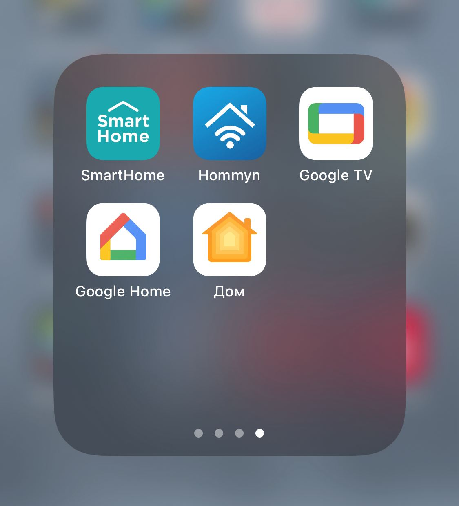

# Task 2. Опыт взаимодействия с интерфейсами.

## **Положительные примеры взаимодействия с интерфейсами:**

### Мобильное приложение для заказа продуктов:

##### Интуитивный процесс выбора блюд, удобная корзина, быстрое оформление заказа, возможность отслеживания статуса доставки.
____
### Онлайн-банкинг:

##### Четкий и простой интерфейс для просмотра баланса, осуществления транзакций и управления счетами, а также уведомления о финансовых операциях.
____
### Сервис стриминга музыки:

##### Удобный поиск и фильтрация музыкальных треков, персонализированные плейлисты, рекомендации и простой процесс создания собственных коллекций.
____
### Социальные сети:

##### Интуитивный интерфейс для просмотра ленты, комментирования, лайков и простой способ обмена контентом с другими пользователями.
____
### Приложение для навигации:

##### Максимально детализированный интерфейс позволяющий более четко ориентироваться на местности, способы управления понятны без отдельного изучения.
____

## **Примеры взаимодействия с интерфейсами, в которых можно предложить улучшения:**

### Сайт для онлайн-покупок:

##### Упрощение процесса возврата товаров и обмена, добавление дополнительных фильтров для удобного поиска товаров, единая стандартизация описания характеристик товаров.
____
### Сервис электронной почты:

##### Стандартизация обработки сообщений с применением лучших мировых практик, исключение ситуации некорректной фильтрации писем.
____
### Сервис онлайн-обучения:

##### Персонализированные рекомендации по курсам, возможность фильтровать и упорядочивать результаты поиска.
____
### Мобильное приложение для поиска работы:

##### Унификация функционала по сравнению с браузерной версией.
____
### Система управления устройствами умного дома:

##### Расширение списка поддерживаемых устройств, более интуитивное управление группами устройств, оптимизация интерфейса для более быстрого доступа к основным функциям. Стандартизация протоколов взаимодействия устройств и создание приложения для управления всеми устройствами с помощью единого приложения с собственным интерфейсом.